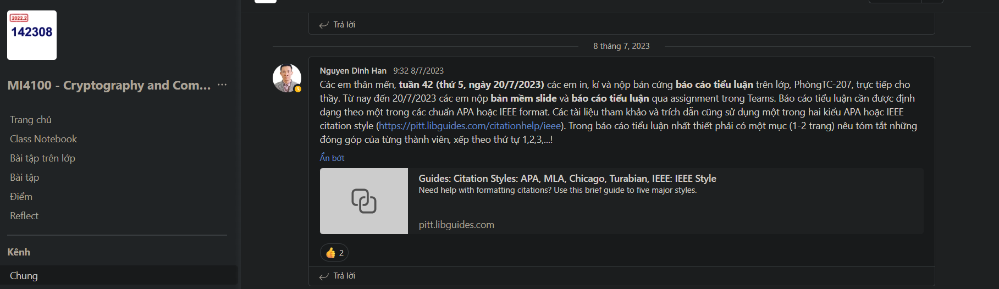

Các em thân mến, tuần 42 (thứ 5, ngày 20/7/2023) các em in, kí và nộp bản cứng báo cáo tiểu luận trên lớp, PhòngTC-207, trực tiếp cho thầy. Từ nay đến 20/7/2023 các em nộp bản mềm slide và báo cáo tiểu luận qua assignment trong Teams. Báo cáo tiểu luận cần được định dạng theo một trong các chuẩn APA hoặc IEEE format. Các tài liệu tham khảo và trích dẫn cũng sử dụng một trong hai kiểu APA hoặc IEEE citation style (https://pitt.libguides.com/citationhelp/ieee). Trong báo cáo tiểu luận nhất thiết phải có một mục (1-2 trang) nêu tóm tắt những đóng góp của từng thành viên, xếp theo thứ tự 1,2,3,...!