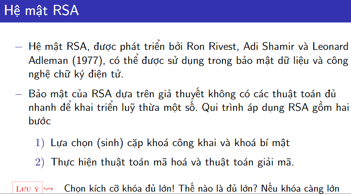
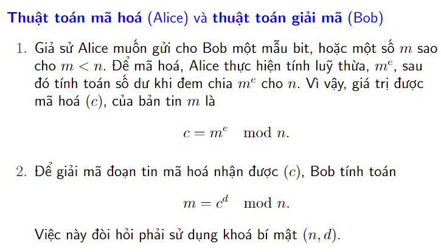

<!-- Lịch sử -->
Hệ mật RSA, được phát triển bởi Ron Rivest, Adi Shamir và Leonard Adleman (1977), có thể được sử dụng trong bảo mật dữ liệu và công nghệ chữ ký điện tử.

Hệ mật đầu tiên ra đời vào năm 1977 do Rivest, Shamir và Adleman

 RSA_RonRivestAdiShamirLeonardAdleman

<!-- % \subsection{Lịch sử} -->
<!-- % \subsection{Khái niệm} -->
<!-- % \subsection{Mô hình tổng quát} -->
<!-- % \subsection{Ưu, nhược điểm của hệ mã hóa công khai} -->

<!-- Ý tưởng -->
<!-- Bảo mật của RSA dựa trên giả thuyết không có các thuật toán đủ nhanh để khai triển luỹ thừa một số. Qui trình áp dụng RSA gồm hai bước: -->

<!-- Lựa chọn (sinh) cặp khóa công khai và khóa bí mật -->

<!-- Thực hiện thuật toán mã hoá và thuật toán giải mã -->

<!--! Mô tả hệ mật -->

<!--! Bảng chữ cái -->

<!--! Sinh cặp khóa công khai  và bí mật -->

<!--! Ví dụ: -->

<!-- code? -->

​

<!--! Áp dụng hệ mật RSA -->

