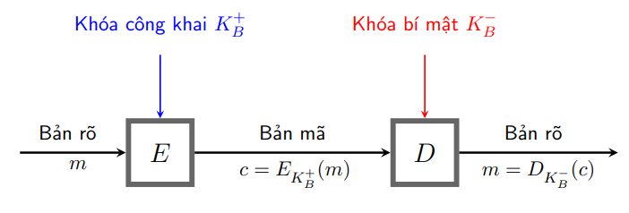

<!-- \section{Tổng quan về hệ mật mã khóa công khai} -->

<!-- Mô hình tổng quát -->

<!-- hệ mật mã khóa công khai bao gồm: bản rõ, bản mã,   mã hóa,   giải mã, khóa công khai K+ và khóa bí mật K-.  hệ mật mã khóa công khai  là hệ mật mã bất đối xứng Vì   mã hóa và giải mã sử dụng khóa khác nhau   -->

<!-- Ứng dụng -->

Xác thực điện tử (Chứng chỉ số, Chữ kí số)

<!-- !-->
<!-- !-->
<!-- !-->
<!-- hệ mật mã khóa công khai là một bước tiến lớn nhất và là cuộc cách mạng thực sự trong lĩnh vực mật mã. -->

<!-- Lịch sử -->

Ý tưởng về hệ thống mã hóa khóa công khai được Martin Hellman, Ralph Merkle và Whitfield Diffie tại Đại học Stanford giới thiệu vào năm 1976.

Sách: Diffie, W.; Hellman, M.E. (November 1976). "New directions in cryptography". IEEE Transactions on Information Theory

<!-- Khái niệm -->

Lưu ý:

Một hệ mật khóa công khai không bao giờ cung cấp độ mật vô điều kiện - thực tế, đó là hàm cửa sập một chiều (a trapdoor one-way function).

<!-- Ý tưởng: -->
<!-- Mỗi người dùng: sử dụng một cặp khóa (khóa công khai, khóa bí mật) -->
<!-- Khóa công cộng: được công bố rộng rãi và được sử dụng trong mã hóa thông tin -->
<!-- Khóa riêng: chỉ do một người nắm giữ và được sử dụng để giải mã thông tin đã được mã hóa bằng khóa công cộng tương ứng -->
<!-- Mã hóa: A muốn gửi thông điệp cho B - mã hóa bằng khóa công khai của B ($$y = E(e_B, x)$$) -->
<!-- Giải mã: B giải mã bằng khóa bí mật của mình ($$x = D(d_B, y)$$) -->
