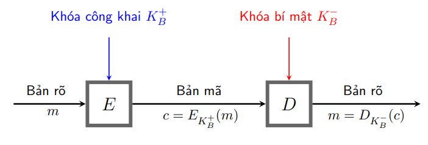

<!-- \section{Tổng quan về hệ mật mã khóa công khai} -->

# Tổng quan về hệ mật mã khóa công khai

## Lịch sử

Ý tưởng về hệ thống mã hóa khóa công khai được Martin Hellman, Ralph Merkle và Whitfield Diffie tại Đại học Stanford giới thiệu vào năm 1976.

Sách: Diffie, W.; Hellman, M.E. (November 1976). "New directions in cryptography". IEEE Transactions on Information Theory

<!-- Khái niệm -->

Mật mã khóa công khai là hệ mã không đối xứng, nghĩa là sử dụng hai khóa liên đới cho việc mã hoá và giải mã thay vì một khóa duy nhất như trong các hệ mã cổ điển. Việc này đáp ứng được các yêu cầu trong các ứng dụng về bảo mật riêng tư, phân phối khóa, và xác thực điện tử.

Lưu ý:

Một hệ mật khóa công khai không bao giờ cung cấp độ mật vô điều kiện - thực tế, đó là hàm cửa sập một chiều (a trapdoor one-way function).

<!-- Mô hình tổng quát -->

<!-- Ý tưởng: -->
<!-- Mỗi người dùng: sử dụng một cặp khóa (khóa công khai, khóa bí mật) -->
<!-- Khóa công cộng: được công bố rộng rãi và được sử dụng trong mã hóa thông tin -->
<!-- Khóa riêng: chỉ do một người nắm giữ và được sử dụng để giải mã thông tin đã được mã hóa bằng khóa công cộng tương ứng -->
<!-- Mã hóa: A muốn gửi thông điệp cho B - mã hóa bằng khóa công khai của B ($$y = E(e_B, x)$$) -->
<!-- Giải mã: B giải mã bằng khóa bí mật của mình ($$x = D(d_B, y)$$) -->

<!--! Những hệ mật khóa công khai quan trọng nhất -->

<!-- RSA: dựa trên độ khó của phép phân tích các số nguyên lớn. -->

<!-- Merkle-Hellman Knapsack: dựa trên độ khó của bài toán subset sum (được biết là NP-complete). Tuy nhiên, có nhiều hệ mật dựa trên bài toán sắp ba lô đã được chứng minh là không bảo mật. -->

<!-- McEliece: dựa trên bài toán giải mã của một mã tuyến tính (cũng được cho là NP-complete). -->

<!-- ElGamal: dựa trên bài toán Logarit rời rạc trên trường hữu hạn. -->

<!-- Chor-Rivest: là một hệ sắp ba lô nhưng được xem là bảo mật. -->

<!-- Elliptic Curve: là sự cải tiến của các hệ mật khác, chẳng hạn tương tự ElGamal nhưng dựa trên các đường cong elíp thay vì trường hữu hạn. Ưu điểm của các hệ mật dạng này là có thể duy trì được độ bảo mật với khóa nhỏ hơn thông thường. -->
