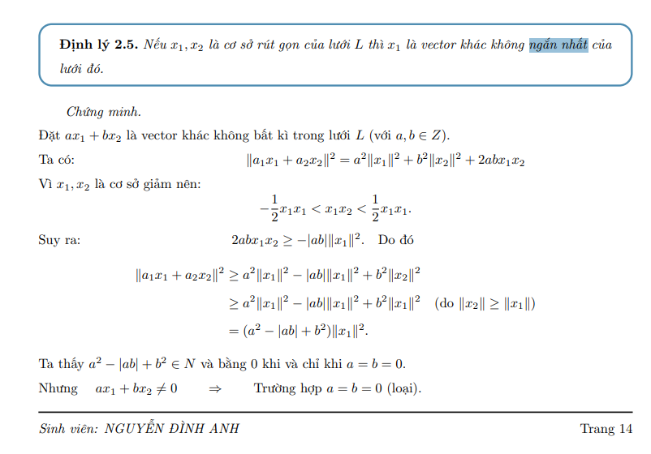
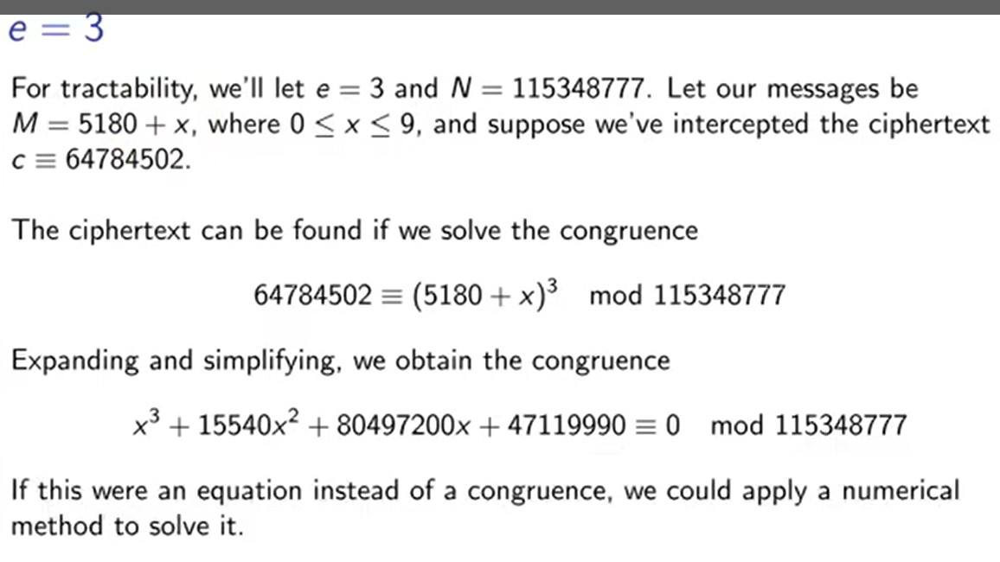
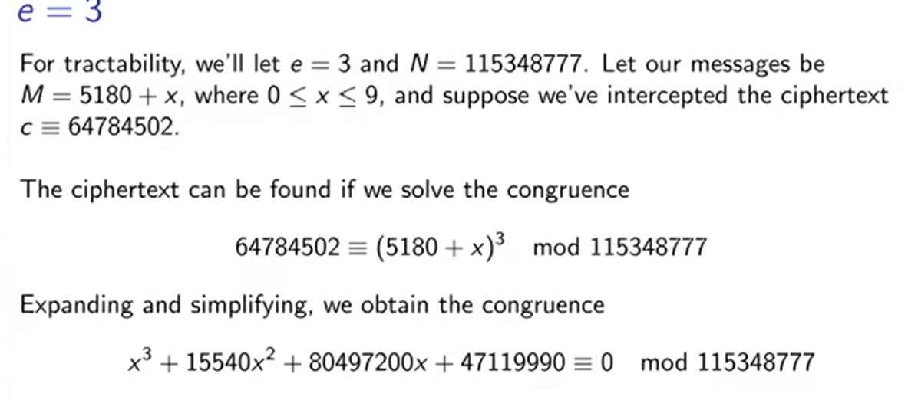
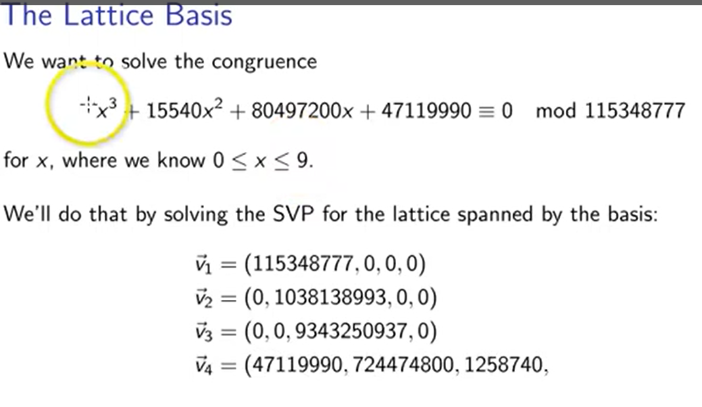
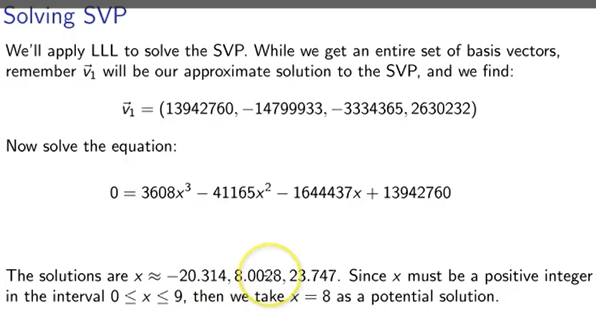
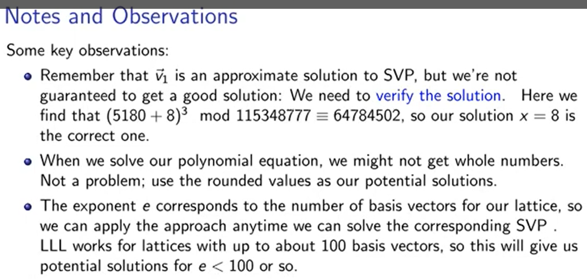

Tìm video k có thì sách DA ...
Chứng minh 1 2 3....
tìm xong chắc là b1 thì ok
Thực hiện các bước bài toán ... latex
Code

<!-- !Bài toán tìm vector ngắn nhất (Shortest Vector Problem - SVP) -->

<!--! Độ dài =..... -->
<!-- \begin{frame}{Vector ngắn nhất} -->
<!-- -->
<!-- \begin{itemize} -->
<!-- \item Độ dài vector $v = (v_1, v_2, \dots, v_n)$ là: -->
<!-- -->
<!-- $$\|v\| = (v_1^2 + v_2^2 + \dots + v_n^2)^{\tfrac{1}{2}}$$ -->
<!-- -->
<!-- -->
<!-- \end{itemize} -->
<!-- -->
<!-- \end{frame} -->

<!-- @ Có nhiều vector ngắn nhất khi đi tìm gần như ngắn nhất (vì theo tg đa thức) -->
<!-- @ Là vector đầu tiên (Chưa học LLL?????) + chứng minh -->
<!-- @Có thể đưa xuống sau LLL -->

<!-- youtube -->
<!-- youtube -->
<!-- youtube -->
<!-- youtube -->
<!-- youtube -->
<!-- youtube -->
<!-- youtube -->
<!-- youtube -->

An Introduction to Mathematical Cryptography (2014) - Hoffstein, Pipher, Silverman

Lecture-Intro_Lattices.pdf

<!--  -->
<!--  -->
<!--  -->
<!--  -->
<!--  -->
<!--  -->
<!--  -->

<!--  -->

e=3
For tractability, we'll let e = 3 and N = 115348777. Let our messages be M 5180 + x, where 0 ≤ x ≤ 9, and suppose we've intercepted the ciphertext c = 64784502.
The ciphertext can be found if we solve the congruence
64784502 = (5180 + x)³ mod 115348777 Expanding and simplifying, we obtain the congruence x³ + 15540x² + 80497200x + 47119990 = 0 mod 115348777 2
If this were an equation instead of a congruence, we could apply a numerical method to solve it.

The Lattice Basis
We want to solve the congruence
+15540x² + 80497200x + 47119990 = 0 mod 115348777
for x, where we know 0 ≤ x ≤ 9.
We'll do that by solving the SVP for the lattice spanned by the basis:
ที₁ = (115348777,0,0,0)
√2 = (0, 1038138993,0,0)
3 = (0,0, 9343250937,0)
√₁ = (47119990, 724474800, 1258740,

Solving SVP
We'll apply LLL to solve the SVP. While we get an entire set of basis vectors, remember v₁ will be our approximate solution to the SVP, and we find:
₁ = (13942760, -14799933, -3334365, 2630232)
Now solve the equation:
03608x341165x21644437x + 13942760
The solutions are x ≈ -20.314, 8.0028, 23.747. Since x must be a positive integer in the interval 0 ≤ x ≤ 9, then we take x = 8 as a potential solution.

Notes and Observations
Some key observations:
• Remember that v₁ is an approximate solution to SVP, but we're not guaranteed to get a good solution: We need to verify the solution. Here we find that (5180+8)3 mod 115348777 = 64784502, so our solution x = 8 is the correct one.
• When we solve our polynomial equation, we might not get whole numbers. Not a problem; use the rounded values as our potential solutions.
• The exponent e corresponds to the number of basis vectors for our lattice, so we can apply the approach anytime we can solve the corresponding SVP. LLL works for lattices with up to about 100 basis vectors, so this will give us potential solutions for e < 100 or so.

<!-- ! -->

e=3
Để có thể điều khiển được, chúng ta sẽ đặt e = 3 và N = 115348777. Giả sử tin nhắn của chúng ta là M 5180 + x, trong đó 0 ≤ x ≤ 9 và giả sử chúng ta đã chặn được bản mã c = 64784502.
Bản mã có thể được tìm thấy nếu chúng ta giải sự đồng dư
64784502 = (5180 + x)³ mod 115348777 Khai triển và đơn giản hóa, chúng ta thu được sự đồng đẳng x³ + 15540x² + 80497200x + 47119990 = 0 mod 115348777 2
Nếu đây là một phương trình thay vì đồng dư, chúng ta có thể áp dụng phương pháp số để giải nó.

Cơ sở mạng tinh thể
Chúng tôi muốn giải quyết sự phù hợp
+15540x² + 80497200x + 47119990 = 0 mod 115348777
với x, trong đó chúng ta biết 0 ≤ x ≤ 9.
Chúng ta sẽ làm điều đó bằng cách giải SVP cho mạng được kéo dài theo cơ sở:
T₁ = (115348777,0,0,0)
√2 = (0, 1038138993,0,0)
3 = (0,0, 9343250937,0)
√₁ = (47119990, 724474800, 1258740,

Giải quyết SVP
Chúng tôi sẽ áp dụng LLL để giải quyết SVP. Mặc dù chúng tôi nhận được toàn bộ tập hợp các vectơ cơ sở, hãy nhớ v₁ sẽ là giải pháp gần đúng của chúng tôi cho SVP và chúng tôi tìm thấy:
₁ = (13942760, -14799933, -3334365, 2630232)
Bây giờ giải phương trình:
03608x341165x21644437x + 13942760
Các nghiệm là x ≈ -20,314, 8,0028, 23,747. Vì x phải là số nguyên dương trong khoảng 0 ≤ x ≤ 9 nên ta lấy x = 8 làm nghiệm tiềm năng.

Ghi chú và quan sát
Một số quan sát chính:
• Hãy nhớ rằng v₁ là một giải pháp gần đúng cho SVP, nhưng chúng tôi không đảm bảo sẽ có được giải pháp tốt: Chúng tôi cần xác minh giải pháp. Ở đây chúng ta thấy rằng (5180+8)3 mod 115348777 = 64784502, vì vậy nghiệm x = 8 của chúng ta là đúng.
• Khi giải phương trình đa thức, chúng ta có thể không nhận được số nguyên. Không thành vấn đề; sử dụng các giá trị làm tròn làm giải pháp tiềm năng của chúng tôi.
• Số mũ e tương ứng với số vectơ cơ sở cho mạng của chúng ta, vì vậy chúng ta có thể áp dụng cách tiếp cận này bất cứ lúc nào chúng ta có thể giải được SVP tương ứng. LLL hoạt động với các mạng có tối đa khoảng 100 vectơ cơ sở, vì vậy điều này sẽ cho chúng ta các giải pháp tiềm năng cho e < 100 hoặc hơn.

<!--  -->
<!--  -->
<!--  -->
<!--  -->
<!--  -->

<!-- Để phá vỡ mã hóa RSA ta cần giải x trong bài toán: -->
<!-- c = (T + x) ^ e mod N -->

Chúng ta có thể chuyển đổi vấn đề này thành bài toán vectơ ngắn nhất, sau đó sử dụng LLL để giải nó.

<!-- @ Thống nhất kí hiệu và biến -->
<!-- @ Thống nhất kí hiệu và biến -->

<!--! Phương pháp lưới -->

Để phá vỡ mã hóa RSA yêu cầu giải phương trình đồng dư $c \equiv (M + x)^e \quad (mod \ N)$

Ta có:
$$x^n + a_{n-1}x^{n-1} + \dots + a_2x^2 + a_1x + a_0 \equiv 0 \quad (mod \ N) $$

Ta có được lưới bởi cơ sở như sau:

<!-- $$
\begin{aligned}
&\Vec{v_1} = (N, 0, 0, \dots, 0, 0)\\
&\Vec{v_2} = (0, YN, 0, \dots, 0, 0)\\
&\vdots\\
&\Vec{v_n} = (0, 0, 0, \dots, Y^{n-1}N, 0)\\
&\Vec{v_{n+1} = (a_0, a_1Y, \dots, a_{n-1}Y^{n-1}, Y^{n})}
\end{aligned}
$$ -->

<!-- @ Tại sao lại có công thức lưới qui định ntn? -->

<!-- !Thực hiện giảm lưới -->

Dùng thuật toán LLL để thực hiện giảm lưới

Ta thu được cơ sở mới sau khi giảm lưới $b_0, b_1, b_2, \dots, b_{n+1}$

<!-- !Tìm vector ngắn nhất -->

Ta sử dụng vector $b_0$ như vector ngắn nhất của lưới và chuyển về dạng đa thức:

<!-- @ chia cho m^xxxxxx -->

$$b_0 + \frac{b_1}{Y}x + \dots + \frac{b_{n-1}}{Y^{n-1}}x^{n-1} + \frac{b_n}{Y^n}x^n $$

=> Cuối cùng, thực hiện giải phương trình đa thức tìm nghiệm nguyên bài toán

<!-- @tìm đc x1 x2 x3 xét thêm x<y để suy ra x -->

<!--@ Gauuusss... -->

<!-- !Ví dụ: https://www.youtube.com/watch?v=vxS0DZE_Lvs -->
<!--  -->
<!--  -->
<!--  -->
<!--  -->
<!--  -->
<!--  -->
<!--  -->
<!--  -->
<!-- det L = |det(x_1, x_2,..., x_n)| -->

<!-- Bổ đề trang 26???? -->

<!-- Định thức của một lưới không phụ thuộc vào cách chọn cơ sở. -->

<!-- trang 40 -->

<!-- @ -->
<!-- # -->

 
<!-- @ Lý thuyết -->
<!-- @ Lịch sử -->
<!-- @ Giới thiệu -->
<!-- @ Mục đích công dụng -->

<!-- @ Hình ảnh liên quan -->

<!-- @ Thuật toán -->
<!-- @ Các bước -->
<!-- @ Sơ đồ thuật toán -->

<!-- @ Code mã nguồn mã giả.... -->

<!-- @ Ví dụ minh họa -->
<!-- @ Chạy tay -->
<!-- @ Chương trình lập trình -->

% <!-- Điều kiện 1 -->

% <!-- Điều kiện 2 -->

% <!-- Mã giả -->

% <!-- Ví dụ -->

% <!--! Thuật toán LLL -->

% <!-- quy trình Gram-Schmidt: -->
% <!--Nếu $x_1, x_2, \dots, x_n$ là một cơ sở của lưới $L$ thì sau khi trực giao hóa ta thu được các vector $x_1^*, x_2^*, \dots, x_n^*$ có thể không nằm trong lưới $L$. -->
% <!-- Vì num là phân số.... -->
% <!-- Xin chào! Bạn có thể vui lòng giải thích mục đích của dòng: bk = bk - [uk, j]bj là gì không? -->
% <!-- quy trình Gram Schmidt làm cho cơ sở trực giao -->
% <!-- Tuy nhiên, trong LLL chúng ta đang làm việc trong một mạng nên không thể đảm bảo tính trực giao. -->
% <!-- Để làm được điều đó, chúng ta cần u_{k, j} là một số nguyên. -->
% <!-- Điều này tạo ra một cơ sở "đủ trực giao" trong khi vẫn còn trong mạng -->

% <!-- 2 chiều -->
% <!-- n chiều -->
% <!-- Thuật toán LLL giảm lưới -->

