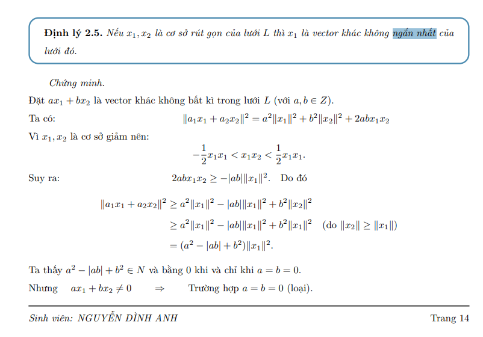

Tìm video k có thì sách DA ...
Chứng minh 1 2 3....
tìm xong chắc là b1 thì ok
Thực hiện các bước bài toán ... latex
Code

<!-- !Bài toán tìm vector ngắn nhất (Shortest Vector Problem - SVP) -->

<!--! Độ dài =..... -->
<!-- \begin{frame}{Vector ngắn nhất} -->
<!-- -->
<!-- \begin{itemize} -->
<!-- \item Độ dài vector $v = (v_1, v_2, \dots, v_n)$ là: -->
<!-- -->
<!-- $$\|v\| = (v_1^2 + v_2^2 + \dots + v_n^2)^{\tfrac{1}{2}}$$ -->
<!-- -->
<!-- -->
<!-- \end{itemize} -->
<!-- -->
<!-- \end{frame} -->

<!-- @ Có nhiều vector ngắn nhất khi đi tìm gần như ngắn nhất (vì theo tg đa thức) -->
<!-- @ Là vector đầu tiên (Chưa học LLL?????) + chứng minh -->
<!-- @Có thể đưa xuống sau LLL -->

<!-- youtube -->
<!-- youtube -->
<!-- youtube -->
<!-- youtube -->
<!-- youtube -->
<!-- youtube -->
<!-- youtube -->
<!-- youtube -->

An Introduction to Mathematical Cryptography (2014) - Hoffstein, Pipher, Silverman

Lecture-Intro_Lattices.pdf

<!--  -->
<!--  -->
<!--  -->
<!--  -->
<!--  -->
<!--  -->
<!--  -->
<!--  -->
<!--  -->
<!--  -->
<!--  -->
<!--  -->

# Vận dụng tấn công RSA

<!--! Giới thiệu bài toán -->

Ví dụ khi chúng ta quên mật khẩu facebook thì facebook sẽ gửi thông tin:

<!-- ảnh -->

Tương tự như:
<!-- Mật khẩu mới của bạn là ***** -->

Thông điệp văn bản m bao gồm phần chữ cái mẫu và phần quan trọng.

=> Nếu số mũ mã hóa e nhỏ, LLL có thể được sử dụng để tấn công RSA trong thời gian đa thức.

<!--! Bài toán -->

Giả sử hệ thống RSA có:

<!-- Khóa công khai n, e -->
<!-- Bản rõ có dạng $m = t + x$ -->

<!-- t là phần mẫu cố định đã biết -->
<!-- x là phần quan trọng thỏa mãn $|x| \leq Y$ với Y nguyên -->

<!-- Để phá vỡ mã hóa RSA ta cần giải x trong bài toán: -->
<!-- c = (T + x) ^ e mod N -->

Chúng ta có thể chuyển đổi vấn đề này thành bài toán vectơ ngắn nhất, sau đó sử dụng LLL để giải nó.

<!-- @ Thống nhất kí hiệu và biến -->
<!-- @ Thống nhất kí hiệu và biến -->

<!--! Phương pháp lưới -->

Để phá vỡ mã hóa RSA yêu cầu giải phương trình đồng dư $c \equiv (M + x)^e \quad (mod \ N)$

Ta có:
$$x^n + a_{n-1}x^{n-1} + \dots + a_2x^2 + a_1x + a_0 \equiv 0 \quad (mod \ N) $$

Ta có được lưới bởi cơ sở như sau:

<!-- $$
\begin{aligned}
&\Vec{v_1} = (N, 0, 0, \dots, 0, 0)\\
&\Vec{v_2} = (0, YN, 0, \dots, 0, 0)\\
&\vdots\\
&\Vec{v_n} = (0, 0, 0, \dots, Y^{n-1}N, 0)\\
&\Vec{v_{n+1} = (a_0, a_1Y, \dots, a_{n-1}Y^{n-1}, Y^{n})}
\end{aligned}
$$ -->

<!-- @ Tại sao lại có công thức lưới qui định ntn? -->

<!-- !Thực hiện giảm lưới -->

Dùng thuật toán LLL để thực hiện giảm lưới

Ta thu được cơ sở mới sau khi giảm lưới $b_0, b_1, b_2, \dots, b_{n+1}$

<!-- !Tìm vector ngắn nhất -->

Ta sử dụng vector $b_0$ như vector ngắn nhất của lưới và chuyển về dạng đa thức:

<!-- @ chia cho m^xxxxxx -->

$$b_0 + \frac{b_1}{Y}x + \dots + \frac{b_{n-1}}{Y^{n-1}}x^{n-1} + \frac{b_n}{Y^n}x^n $$

=> Cuối cùng, thực hiện giải phương trình đa thức tìm nghiệm nguyên bài toán

<!-- @tìm đc x1 x2 x3 xét thêm x<y để suy ra x -->

<!--@ Gauuusss... -->

<!-- !Ví dụ: https://www.youtube.com/watch?v=vxS0DZE_Lvs -->
<!--  -->
<!--  -->
<!--  -->
<!--  -->
<!--  -->
<!--  -->
<!--  -->
<!--  -->
<!-- det L = |det(x_1, x_2,..., x_n)| -->

<!-- Bổ đề trang 26???? -->

<!-- Định thức của một lưới không phụ thuộc vào cách chọn cơ sở. -->

<!-- trang 40 -->

<!-- @ -->
<!-- # -->

 
<!-- @ Lý thuyết -->
<!-- @ Lịch sử -->
<!-- @ Giới thiệu -->
<!-- @ Mục đích công dụng -->

<!-- @ Hình ảnh liên quan -->

<!-- @ Thuật toán -->
<!-- @ Các bước -->
<!-- @ Sơ đồ thuật toán -->

<!-- @ Code mã nguồn mã giả.... -->

<!-- @ Ví dụ minh họa -->
<!-- @ Chạy tay -->
<!-- @ Chương trình lập trình -->

